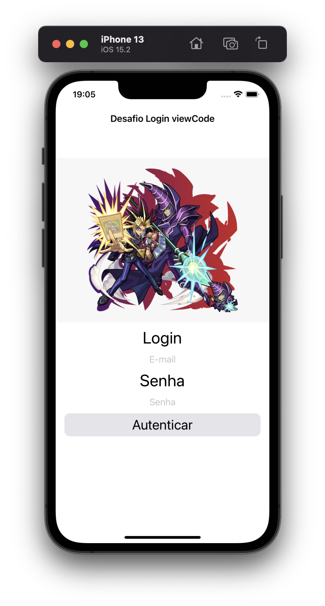
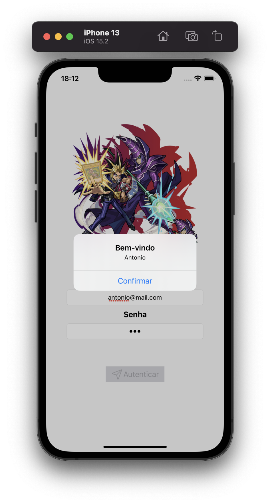
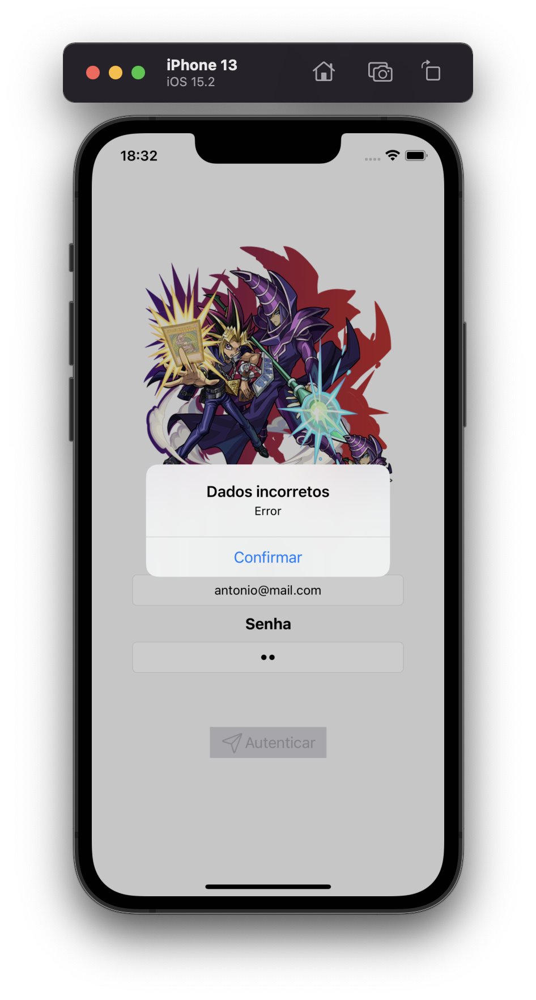

## App simples de login
Objetivo do desafio simular uma tela de login e validar se os campos de email e senha estão corretos usando ViewCode.
Se forem validos, criar um alert autenticado com sucesso, caso contrário exibir um alert informando um erro!

  
  
  

